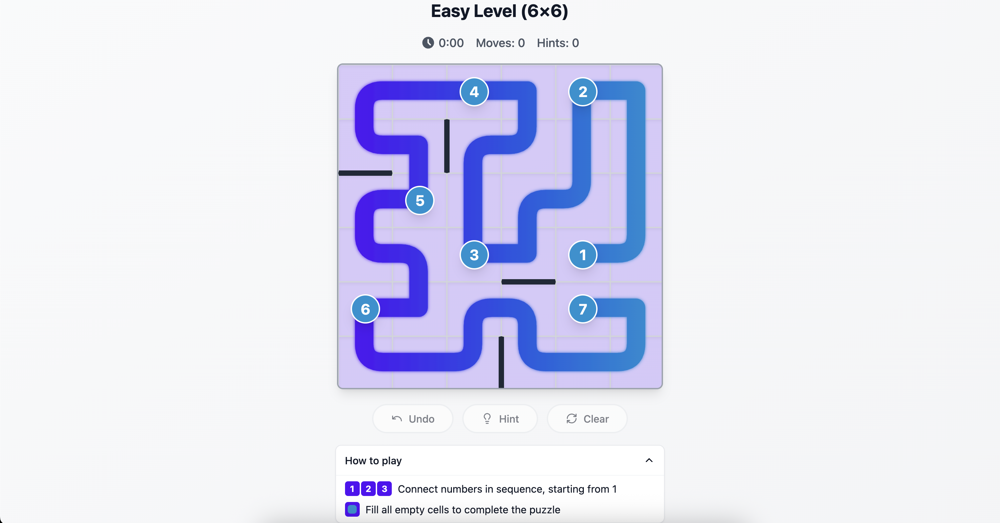

#  Ziip - A Puzzle Adventure

Connect the dots in this minimalist yet challenging puzzle game. Draw paths between numbered cells while navigating through walls and obstacles.

<div align="center">
  
</div>

## 🎯 Features

- Minimalist and elegant design
- Smooth path drawing with beautiful animations
- Responsive layout for both desktop and mobile
- Progressive difficulty levels
- Touch-friendly interface

## 🚀 Tech Stack

- **Framework**: React + Vite
- **Language**: TypeScript
- **Styling**: Tailwind CSS
- **UI Components**: shadcn/ui
- **Build Tool**: Vite

## 📥 Getting Started

### Prerequisites

Make sure you have Node.js & npm installed - [install with nvm](https://github.com/nvm-sh/nvm#installing-and-updating)

### Installation

1. Clone the repository

```sh
git clone <YOUR_GIT_URL>
```

2. Navigate to the project directory

```sh
cd ziip.fun
```

3. Install dependencies

```sh
npm install
```

4. Start the development server

```sh
npm run dev
```

The game will be available at `http://localhost:5173`

## 🎮 How to Play

1. Click or touch a numbered cell to start
2. Draw a path to another numbered cell
3. Connect all numbered cells while following these rules:
   - Paths cannot cross
   - You cannot go through walls
   - All numbered cells must be connected
   - Fill all empty cells with your path

## 🛠️ Development

### Available Scripts

- `npm run dev` - Start development server
- `npm run build` - Build for production
- `npm run preview` - Preview production build
- `npm run lint` - Run ESLint
- `npm run type-check` - Run TypeScript type checking

## 🚀 Deployment

You can deploy this project in multiple ways:

1. **Via Lovable**

   - Visit [Lovable Project](https://lovable.dev/projects/52960167-531a-47a8-a081-b72e0bb3b7fb)
   - Click on Share -> Publish

2. **Custom Domain**
   - Navigate to Project > Settings > Domains
   - Click Connect Domain
   - Follow the [custom domain setup guide](https://docs.lovable.dev/tips-tricks/custom-domain#step-by-step-guide)

## 📝 License

This project is licensed under the MIT License - see the [LICENSE](LICENSE) file for details.

## 🤝 Contributing

Contributions are welcome! Feel free to submit a Pull Request.

---

Made with ❤️ using [Lovable](https://lovable.dev)
