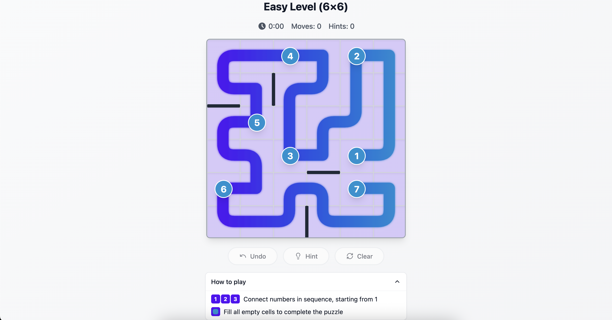

#  Ziip.fun - Open Source Zip Game

An open-source alternative to LinkedIn's Zip game. Challenge yourself with this minimalist puzzle game where you connect the dots while navigating through walls and obstacles. Available in both React and Vue implementations.

<div align="center">
  
</div>

## ✨ Why Ziip?

- **100% Free & Open Source**: No account or subscription required
- **Multiple Implementations**: Choose between React or Vue
- **Modern Tech Stack**: Built with the latest web technologies
- **Self-hostable**: Deploy your own instance
- **Customizable**: Fork and modify to create your own version
- **Daily Challenges**: New puzzles every day
- **Progressive Difficulty**: From beginner to expert levels

## 🎯 Available Apps

- [React + Vite App](apps/vite) - The original implementation using React 18, Vite, and shadcn/ui
- [Nuxt App](apps/nuxt) - A Vue 3 port using Nuxt 3, TypeScript, and Pinia

## 🚀 Tech Stack

### Shared

- **Language**: TypeScript
- **Styling**: Tailwind CSS
- **Package Manager**: pnpm with workspaces

### React App (Vite)

- **Framework**: React 18
- **Build Tool**: Vite
- **UI Components**: shadcn/ui

### Vue App (Nuxt)

- **Framework**: Nuxt 3
- **Vue Version**: Vue 3 with Composition API
- **State Management**: Pinia
- **Features**: Auto-imports, SSR, file-based routing

## 📥 Getting Started

### Prerequisites

- Node.js (v18 or higher)
- pnpm (v9 or higher)

### Installation

1. Clone the repository

```sh
git clone <YOUR_GIT_URL>
```

2. Navigate to the project directory

```sh
cd ziip.fun
```

3. Install dependencies

```sh
pnpm install
```

4. Start the development servers

```sh
# Run React (Vite) app
pnpm dev:vite

# Run Nuxt app
pnpm dev:nuxt

# Run both apps
pnpm dev:vite & pnpm dev:nuxt
```

The games will be available at:

- React: `http://localhost:5173`
- Nuxt: `http://localhost:3000`

## 🎮 How to Play

1. Click or touch a numbered cell to start
2. Draw a path to another numbered cell
3. Connect all numbered cells while following these rules:
   - Paths cannot cross
   - You cannot go through walls
   - All numbered cells must be connected
   - Fill all empty cells with your path

## 🛠️ Development

### Available Scripts

```bash
# Install dependencies for all apps
pnpm install

# Run linting for all apps
pnpm lint

# Build all applications
pnpm build:vite && pnpm build:nuxt
```

## 🚀 Deployment

You can deploy either application:

1. **React App (Vite)**

   - Visit [Lovable Project](https://lovable.dev/projects/52960167-531a-47a8-a081-b72e0bb3b7fb)
   - Click on Share -> Publish

2. **Nuxt App**
   - Follow the [Nuxt deployment guide](https://nuxt.com/docs/getting-started/deployment)

## 🤝 Contributing

Contributions are welcome! Feel free to:

- Report bugs
- Suggest new features
- Submit pull requests
- Improve documentation
- Share the project

## 📝 License

This project is licensed under the MIT License - see the [LICENSE](LICENSE) file for details.

## ⭐ Show Your Support

If you find this project useful, please consider:

- Giving it a star on GitHub
- Sharing it with friends and colleagues
- Contributing to its development

---

Made with ❤️ by the community | [Lovable](https://lovable.dev)
